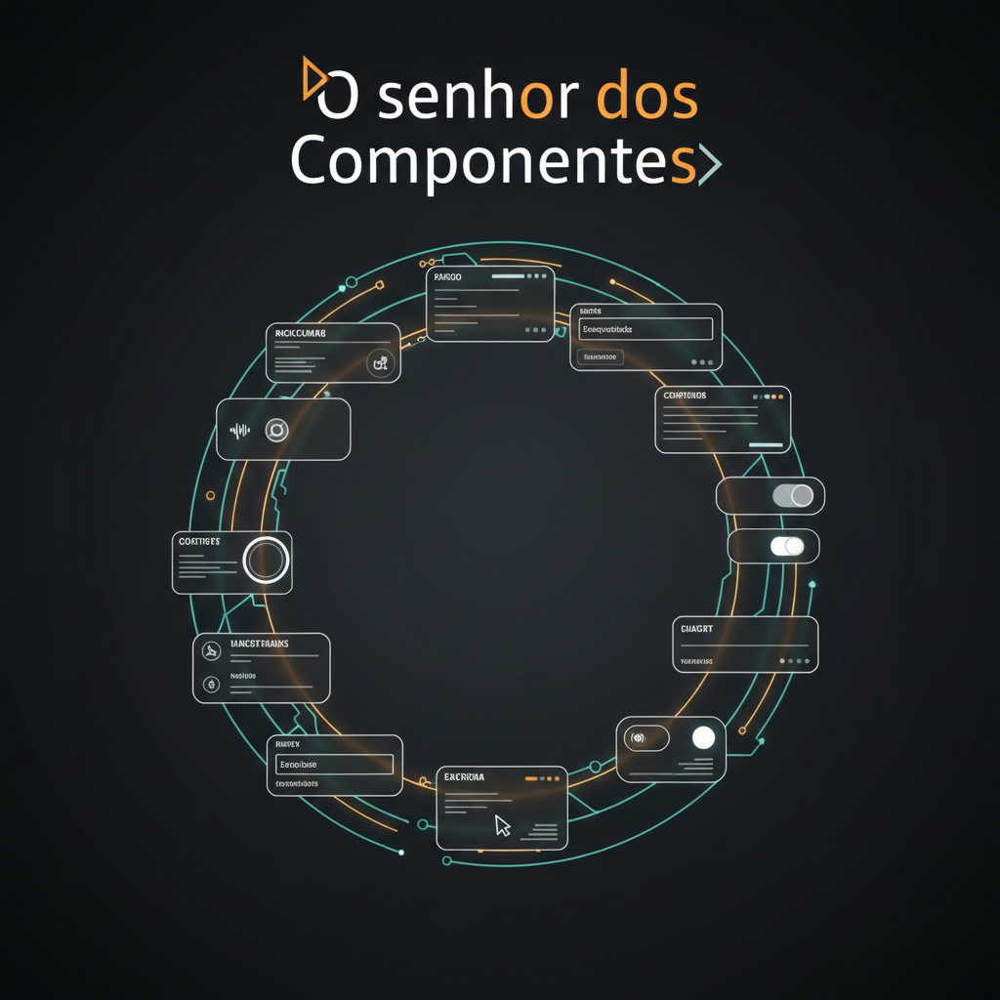

  

# O Senhor dos Componentes: Interface e Acessibilidade no Front

Repositório do episódio de podcast criado com apoio de IAs Generativas, focado em prototipagem, acessibilidade e qualidade no front-end.

## 🎧 Episódio
- **Título:** O Senhor dos Componentes: prototipagem, acessibilidade e qualidade
- **Duração:** 8–12 min
- **Áudio:** [episodio-01-final.mp3](audio/episodio-01-final.mp3)
- **Capa:** [capa-oficial.png](assets/cover/capa-oficial.png)

## 🧩 Prompts utilizados
- [01-roteiro-master.md](prompts/01-roteiro-master.md)
- [02-claridade-master.md](prompts/02-claridade-master.md)
- [03-auditoria-tecnica-master.md](prompts/03-auditoria-tecnica-master.md)
- [04-capa-imagem-master.md](prompts/04-capa-imagem-master.md)
- [05-descricao-seo-master.md](prompts/05-descricao-seo-master.md)

## 🛠️ Ferramentas citadas
- **Lighthouse** (Google) — auditoria de desempenho e acessibilidade  
- **axe-core** (Deque) — testes automáticos de acessibilidade  
- **Core Web Vitals** (Google) — métricas de experiência do usuário  
- **WebAIM Contrast Checker** — verificação de contraste

## 🔊 Padrões de áudio
- Loudness: -16 LUFS
- Formato: MP3 128–192 kbps

## 📜 Licença
MIT License

---
> Projeto estruturado para ser claro, replicável e auditável: prompts, roteiro, áudio final e materiais de distribuição.
